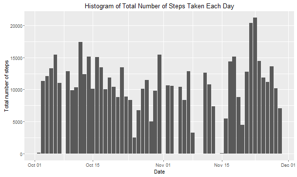
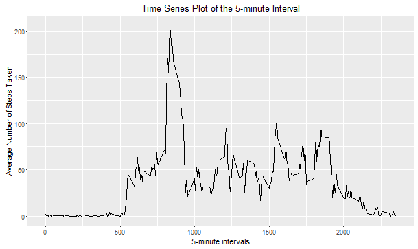
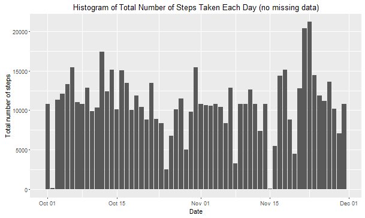
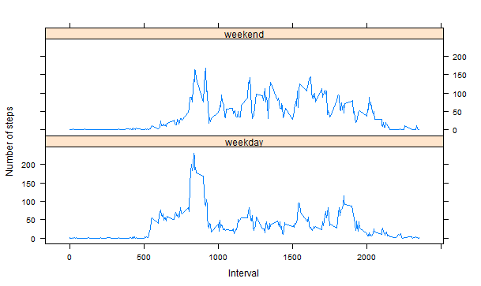

Reproducible Research: Peer Assessment 1

### Basic settings
```{r}
echo = TRUE  # Always make code visible
options(scipen = 1)  # Turn off scientific notations for numbers
```

### Loading and processing the data
```{r}
setwd(file.path("C:\\Users\\user\\Documents\\GitHub\\RepData_PeerAssessment1-master"))
unzip("activity.zip")
activity_data<-read.csv("activity.csv",header = TRUE,colClasses = c("integer","Date","factor"))
str(activity_data)
head(activity_data)

activity_data_clean<-na.omit(activity_data)
library(ggplot2)
```


### What is mean total number of steps taken per day?

* Make a histogram of the total number of steps taken each day
```{r}
ggplot(activity_data_clean,aes(x = date,y = steps))+geom_bar(stat="identity")+labs(title = "Histogram of Total Number of Steps Taken Each Day", x = "Date", y = "Total number of steps")
```

 

* Calculate the mean and median total number of steps taken per day

Mean total number of steps taken per day:
```{r}
totalSteps <- aggregate(activity_data_clean$steps, list(activity_data_clean$date), FUN = "sum")$x
mean(totalSteps)
```


Median total number of steps taken per day:
```{r}
median(totalSteps)
```

### What is the average daily activity pattern?
* Make a time series plot  of the 5-minute interval (x-axis) and the average number of steps taken, across all days (y-axis)

```{r}
avgSteps <- aggregate(activity_data_clean$steps, list(interval = as.numeric(as.character(activity_data_clean$interval))), FUN = "mean")


ggplot(avgSteps, aes(interval, avgSteps[2])) + geom_line() + labs(title = "Time Series Plot of the 5-minute Interval", x = "5-minute intervals", y = "Average Number of Steps Taken")
```

 
* Which 5-minute interval, on average across all the days in the dataset, contains the maximum number of steps?
```{r}
avgSteps[avgSteps$x == max(avgSteps$x), ]
```

### Imputing missing values
* The total number of rows with NAs:

```{r}
sum(is.na(activity_data))
```

* To impute missing values, try filling with median (rounding it off,cause steps need to be a whole number.) of the day for all the intervals corresponding to the day.

```{r}
newActivityData <- activity_data 
for (i in 1:nrow(newActivityData)) {
    if (is.na(newActivityData$steps[i])) {
        newActivityData$steps[i]<-round(avgSteps[which(newActivityData$interval[i] == avgSteps$interval), ]$x)
    }
}

head(newActivityData)
sum(is.na(newActivityData))
```

* Make a histogram of the total number of steps taken each day and Calculate and report the mean and median total number of steps taken per day. 

```{r}
ggplot(newActivityData, aes(date, steps)) + geom_bar(stat = "identity")+labs(title = "Histogram of Total Number of Steps Taken Each Day (no missing data)", x = "Date", y = "Total number of steps")
```

 

* Do these values differ from the estimates from the first part of the assignment? What is the impact of imputing missing data on the estimates of the total daily number of steps?

Mean total number of steps taken per day:
```{r}
newTotalSteps <- aggregate(newActivityData$steps, 
                           list(Date = newActivityData$date), 
                           FUN = sum)$x
newMean <- mean(newTotalSteps)
newMean
```
Median total number of steps taken per day:
```{r}
newMedian <- median(newTotalSteps)
newMedian
```
Compare them with the two before imputing missing data:
```{r}
oldMean <- mean(totalSteps)
oldMedian <- median(totalSteps)
newMean - oldMean
newMedian - oldMedian
```
So, after imputing the missing data, the new mean of total steps taken per day is less than that of the old mean; the new median of total steps taken per day is less than that of the old median.

### Are there differences in activity patterns between weekdays and weekends?

* Create a new factor variable in the dataset with two levels -- "weekday" and "weekend" indicating whether a given date is a weekday or weekend day.

```{r}
head(newActivityData)
newActivityData$weekdays <- factor(format(newActivityData$date, "%A"))
levels(newActivityData$weekdays)
levels(newActivityData$weekdays) <- list(weekday = c("Monday", "Tuesday",
                                             "Wednesday", 
                                             "Thursday", "Friday"),
                                 weekend = c("Saturday", "Sunday"))
levels(newActivityData$weekdays)
table(newActivityData$weekdays)
```

* Make a time series plot  of the 5-minute interval (x-axis) and the average number of steps taken, across all weekdays and weekend (y-axis)

```{r}
avgSteps <- aggregate(newActivityData$steps, 
                      list(interval = as.numeric(as.character(newActivityData$interval)), 
                           weekdays = newActivityData$weekdays),
                      FUN = mean)

library(lattice)
xyplot(avgSteps$x ~ avgSteps$interval | avgSteps$weekdays, 
       layout = c(1, 2), type = "l", 
       xlab = "Interval", ylab = "Number of steps")
```
 